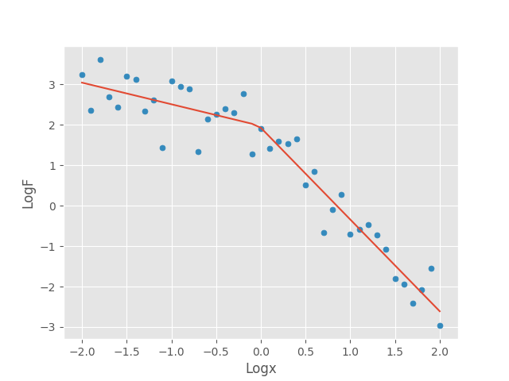
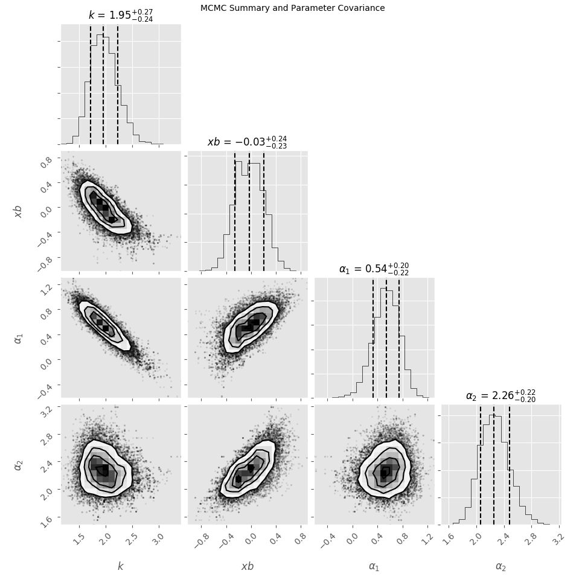

# Broken-Power-Law MCMC
Define a broken power law in log space, inject gaussian noise, and fit using PyMC. Make cool traingle plots with Corner. 






## Usage
Running 
```bash
$ python BPL_MCMC.py
```
will generate,
 - par_summary.csv, containing the final parameter summaries
 - covariance_matrix.txt, containing an estiamte of the covariance matrix
 - trace_array.txt, containing the trace for each parameter
 - best_fit_BPL.png, plot of the best-fit line using expectation values for each parameter
 - tri_plot.pdf, a triangle plot of contours and posterior distributions made with Corner


## Dependencies
PyMC, Corner, and Pandas can be installed with

```bash
$ pip install -r requirements.txt
```
[PyMC Documentation](http://pymc-devs.github.io/pymc/)

[Corner Documentation](http://corner.readthedocs.io/en/latest/)

