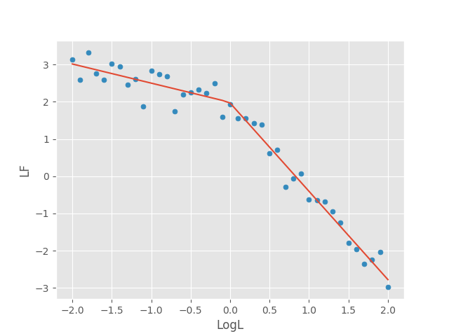
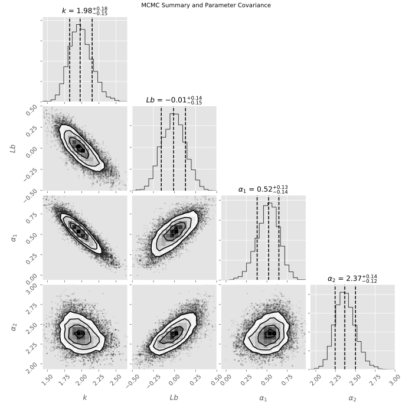

# Broken-Power-Law MCMC
Define a broken power law in log space, inject gaussian noise, and fit using PyMC. Make cool traingle plots with Corner. 



Generate triangle plot with corner



## Usage
Running 
```bash
$ python BPL_MCMC.py
```
will generate,
 - summary plots for each parameter
 - a .csv with the final parameter summaries
 - a text file of the covariance matrix
 - a text file containing the trace for each parameter
 - plot of best-fit line using the MAP estimate of each parameter
 - triangle plot of contours and posterior distributions made with Corner


## Dependencies
PyMC, Corner, and Pandas can be installed with

```bash
$ pip install -r requirements.txt
```
[PyMC Documentation](http://pymc-devs.github.io/pymc/)

[Corner Documentation](http://corner.readthedocs.io/en/latest/)

